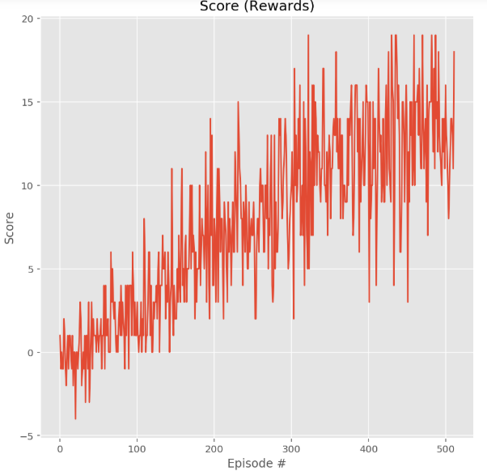

# Project report

## Learning algorithm

The learning algorithm used is vanilla Deep Q Learning as described in original paper. As an input the vector of state is used instead of an image so convolutional neural nework is replaced with deep neural network. The deep neural network has following layers:

- Fully connected layer - input: 37 (state size) output: 128
- Fully connected layer - input: 128 output 64
- Fully connected layer - input: 64 output: (action size)

Parameters used in DQN algorithm:

- Maximum steps per episode: 1000
- Starting epsilion: 1.0
- Ending epsilion: 0.01
- Epsilion decay rate: 0.995

For tuning, there are several hyperparamters that we can tune to get a satisfactory result. 

- Replay buffer size: The no. of agent experiences available in the buffer for sampling during the training stage of the fully-connected MLP network
- Batch size: The no. of samples taken from the Replay Buffer each time the fully-connected is trained
- Gamma: A time-discount factor, which is applied to the expected action-value of the subsequent state. A low value here optimizes for short-term rewards, while a value close to 1 discounts future rewards very little
- Tau: Controls how much the Q-network is updated after each learning and optimization stage. A value of 1 replaces the expected Q values entirely, while a value of zero equates to no update.
- Update frequency: Controls the number of episodes that are run between training of the fully-connected Q-network.

## Results


```
Episode 100	Average Score: 1.01
Episode 200	Average Score: 4.59
Episode 300	Average Score: 7.98
Episode 400	Average Score: 11.52
Episode 500	Average Score: 12.77
Episode 512	Average Score: 13.04
Environment solved in 412 episodes!	Average Score: 13.04

Total Training time = 11.0 min
```

## Ideas for future work

1. Extensive hyperparameter optimization
2. Double Deep Q Networks
3. Dueling Deep Q Networks
4. RAINBOW Paper
5. Learning from pixels
